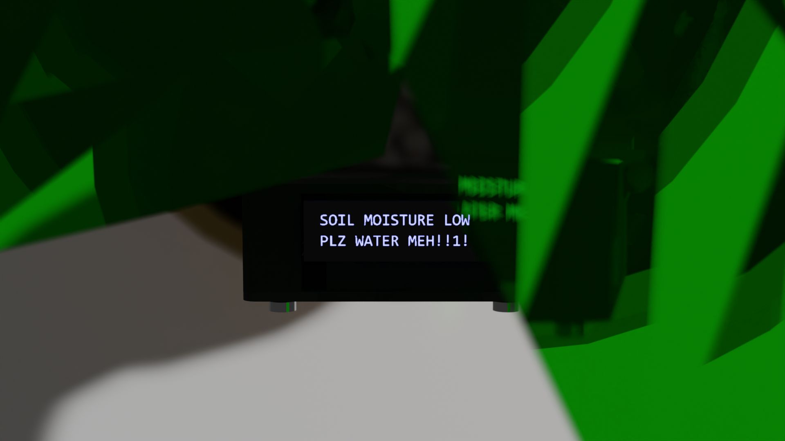
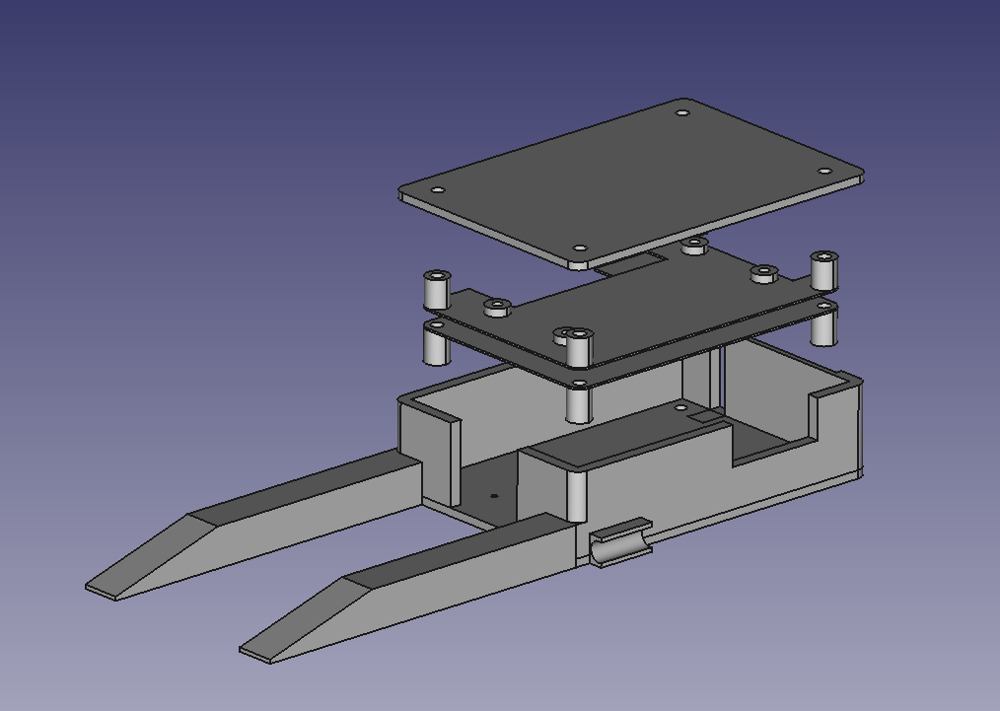

# Plant Monitor


Keep an eye on a plant to learn how to take care of it.







## Install

Fresh version of raspberry pi OS lite (no GUI)

Make sure to set the hostname and wifi credentials

Login, install mycodo from their website

https://kizniche.github.io/Mycodo/#install

Upload the backup to the web UI

try to restore

If the screen doesn't work, there might be dependencies. Check the log to know which package to install. I had to do:

```
sudo apt install libopenjp2-7
```